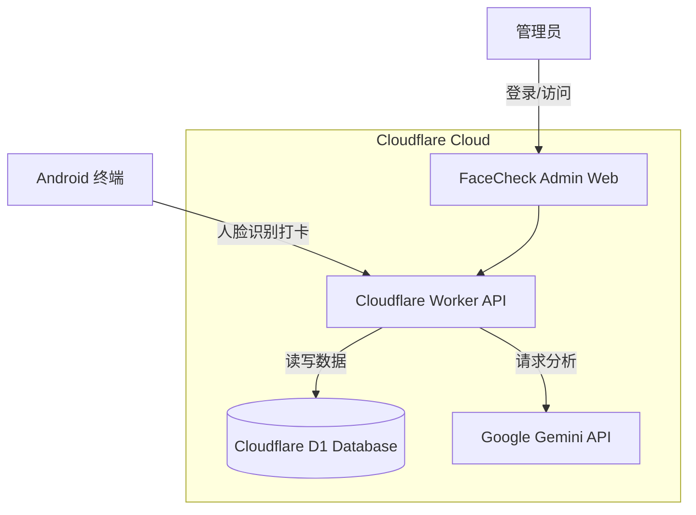

# FaceCheck Admin - 智能考勤管理后台


**FaceCheck Admin** 是一个轻量级、现代化的考勤管理后台系统，专为配合 [FaceCheck Android App](https://github.com/tonygyf/FaceCheck) 使用而设计。

本项目基于 **React** 构建前端，部署于 **Cloudflare Workers**，并利用 **Cloudflare D1 (SQLite)** 作为边缘数据库，实现了极低成本、高并发的考勤数据处理。同时集成 **Google Gemini AI** 用于生成智能考勤周报和异常分析。

---

## ✨ 主要功能

*   **🔐 安全认证**: 完整的管理员注册与登录系统。
*   **📊 实时仪表盘**: 概览今日出勤率、迟到人数及周趋势图表。
*   **👥 员工管理**: 管理员工信息、职位及人脸录入状态。
*   **📝 考勤日志**: 实时查看从 Android 端上传的打卡记录及置信度分数。
*   **🤖 AI 智能洞察**: 集成 Google Gemini，一键生成考勤健康度分析报告。
*   **⚡ Serverless 架构**: 无需购买服务器，秒级部署，自动扩容。

---

## 📸 项目截图

> *请在项目运行后截图并替换以下链接*

| 登录页面 | 仪表盘概览 |
| :---: | :---: |
|  |  |

| 员工管理 | AI 智能分析 |
| :---: | :---: |
|  |  |

---

## 🏗️ 系统架构



---

## 🚀 快速开始

### 1. 环境准备

确保你已经安装了以下工具：
*   [Node.js](https://nodejs.org/) (v16+)
*   [Wrangler CLI](https://developers.cloudflare.com/workers/wrangler/install-and-update/) (Cloudflare 的命令行工具)

```bash
npm install -g wrangler
wrangler login
```

### 2. 初始化项目

```bash
# 克隆仓库
git clone https://github.com/your-username/FaceCheck-Admin.git
cd FaceCheck-Admin

# 安装依赖
npm install
```

### 3. 配置 Cloudflare D1 数据库

本项目使用 D1 作为数据库。你需要先创建一个 D1 数据库。

```bash
# 1. 创建数据库 (名称自定义，这里用 facecheck-db)
wrangler d1 create facecheck-db

# 2. 控制台会返回 database_id，请记下它！
# 格式如: binding = "DB", database_name = "facecheck-db", database_id = "xxxx-xxxx-xxxx"
```

**修改 `wrangler.toml` 文件：**
打开项目根目录下的 `wrangler.toml` (如果没有请新建)，填入以下内容：

```toml
name = "facecheck-admin"
main = "worker.ts"
compatibility_date = "2024-02-08"

# 静态资源配置 (前端页面)
[site]
bucket = "./dist"

# D1 数据库绑定
[[d1_databases]]
binding = "DB" # 代码中通过 env.DB 访问
database_name = "facecheck-db"
database_id = "替换为你刚刚生成的-database-id"
```

### 4. 初始化数据库表结构

将以下 SQL 保存为 `schema.sql`，然后执行初始化命令：

**schema.sql:**
```sql
DROP TABLE IF EXISTS attendance;
DROP TABLE IF EXISTS users;
DROP TABLE IF EXISTS admins;

-- 管理员表 (新增)
CREATE TABLE admins (
  id TEXT PRIMARY KEY,
  email TEXT UNIQUE NOT NULL,
  password TEXT NOT NULL, -- SHA-256 Hash
  createdAt TEXT DEFAULT CURRENT_TIMESTAMP
);

CREATE TABLE users (
  id TEXT PRIMARY KEY,
  name TEXT NOT NULL,
  department TEXT,
  role TEXT,
  status TEXT DEFAULT 'active',
  avatarUrl TEXT,
  lastSeen TEXT,
  faceEmbeddings TEXT
);

CREATE TABLE attendance (
  id TEXT PRIMARY KEY,
  userId TEXT,
  userName TEXT,
  timestamp TEXT,
  status TEXT,
  confidenceScore REAL,
  deviceInfo TEXT
);

-- 插入一些测试数据 (可选)
INSERT INTO users (id, name, department, role, status) VALUES 
('u1', 'Tony Stark', 'Engineering', 'CTO', 'active'),
('u2', 'Steve Rogers', 'Security', 'Manager', 'active');
```

**执行初始化:**

```bash
# 本地测试环境初始化
wrangler d1 execute facecheck-db --local --file=./schema.sql

# 生产环境初始化
wrangler d1 execute facecheck-db --remote --file=./schema.sql
```

### 5. 配置 AI API Key (可选)

如果你想使用“AI 洞察”功能，需要配置 Google Gemini API Key。

```bash
wrangler secret put API_KEY
# 提示输入时，粘贴你的 Google Gemini API Key
```

### 6. 本地开发与部署

**本地运行:**

```bash
# 开启 Cloudflare Worker 本地开发模式
npm run start 
# 或者
wrangler dev
```

**部署上线:**

```bash
# 构建前端并部署 Worker
npm run build
wrangler deploy
```

部署成功后，你会获得一个 URL（例如 `https://facecheck-admin.your-subdomain.workers.dev`），这就是你的后台地址，也是 Android App 需要连接的 API Base URL。

---

## 🔌 API 接口文档

Android 端和 Web 端均通过以下 RESTful 接口与后端交互。

**Base URL:** `https://<你的worker域名>.workers.dev`

### 1. 考勤打卡 (Android 端核心接口)

*   **URL:** `/api/attendance`
*   **Method:** `POST`
*   **Request Body:**
```json
{
  "userId": "u1",
  "userName": "Tony Stark",
  "status": "PRESENT",
  "confidenceScore": 0.98,
  "deviceInfo": "Android Device 1",
  "timestamp": "2023-10-27T09:00:00Z"
}
```

### 2. 管理员认证

*   **注册:** `POST /api/auth/register`
*   **登录:** `POST /api/auth/login`

---

## 📄 License

MIT License.
